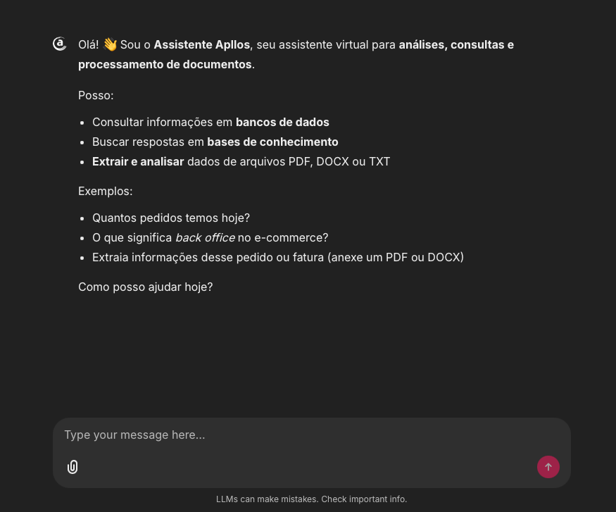
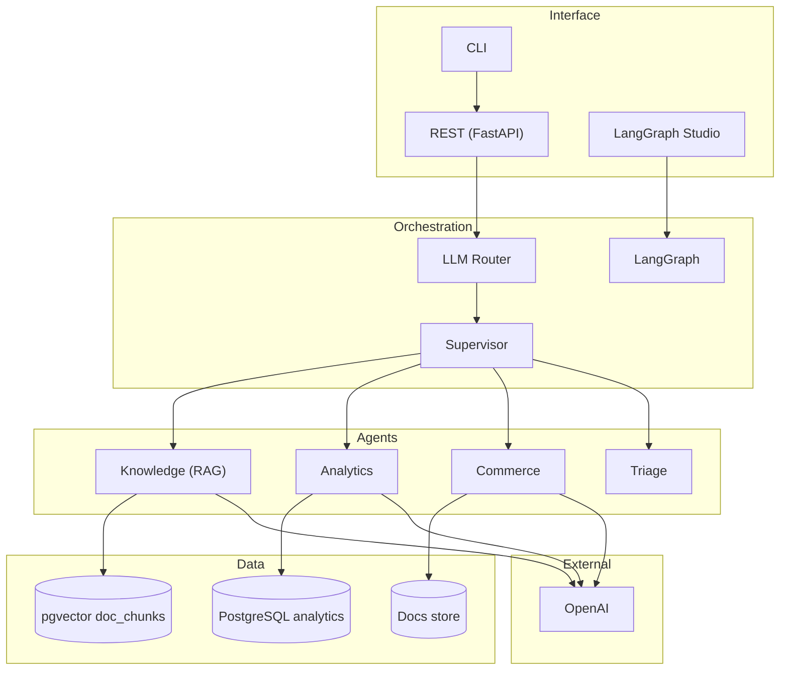

# Apllos Generative AI Challenge

[](https://python.org) [](https://langchain-ai.github.io/langgraph/) [](https://postgresql.org) [](https://docker.com) [](https://openai.com)

> Multi‑Agent assistant for e‑commerce analytics, knowledge retrieval (RAG) and commerce document processing, powered by LangGraph.

## Contents

- [Overview](#overview)
- [Quick Start](#quick-start)
- [Architecture](#architecture)
- [Agents](#agents)
- [API](#api)
- [Development](#development)
- [Documentation](#documentation)

---

## Overview

The Apllos Generative AI Challenge Assistant is a multi-agent system designed for e-commerce analytics, knowledge retrieval, and document processing. Built with LangGraph and powered by LLMs, it provides context-aware responses in Brazilian Portuguese.

<p align="center">
  
</p>

### Key Features

- **Multi-Agent Orchestration**: LLM-based routing with supervisor guardrails
- **Analytics**: SQL generation with allowlist validation, read-only execution, and data balancing
- **Knowledge RAG**: Vector-based document retrieval with cross-validation and citations
- **Document Processing**: Multi-format support (PDF/DOCX/TXT/OCR) with structured extraction
- **Prompt Engineering**: Chain-of-Thought reasoning, self-consistency checks, and confidence calibration
- **Deployment**: Docker Compose deployment with observability and error handling

### Core Capabilities

- **Analytics Agent**: Converts natural language queries into SQL with data balancing
- **Knowledge Agent**: Retrieves and synthesizes information from document stores with citations
- **Commerce Agent**: Processes commercial documents with structured data extraction
- **Triage Agent**: Handles ambiguous queries with fallback and guidance

---

## Quick Start

### Docker (recommended)

```bash
# 1) Clone
git clone https://github.com/amcerri/apllos-generativeai-challenge.git
cd apllos-generativeai-challenge

# 2) Environment variables
cp .env.example .env
# edit .env (OPENAI_API_KEY, etc.)

# 3) Full bootstrap (DB + ingestions + Studio)
make bootstrap-complete

# 4) Access
make studio-up
# Extended health check
curl http://localhost:2024/ok
# => {"status":"ok","db":"ok|down","checkpointer":"ok|noop"}

# Optional: Chainlit frontend (chat UI)
make frontend-up
```

### Local environment

```bash
# Dependencies
pip install -e .

# Database
make db-start
make db-wait
make db-init
make db-seed

# Ingestions
make ingest-analytics
make ingest-vectors   # inclui ANALYZE doc_chunks

# Studio
make studio-up
```

Quick test (CLI)

```bash
# Analytics
make query QUERY="Quantos pedidos existem no total?"
# Knowledge
make query QUERY="Quais são as melhores práticas de precificação no e‑commerce?"
# Commerce with attachment
make query QUERY="Analise este pedido" ATTACHMENT="data/samples/orders/Simple Order.docx"
```

---

## Architecture



**Key decisions:**

- Fallbacks everywhere (no hard deps at import time)
- Settings via Pydantic + YAML; models centralized under `settings.models.*`
- Human approval gates for SQL (interrupts) when enabled

---

## Agents

### Analytics

- **Planner**: NL → safe SQL (allowlist, no DDL/DML, prefix fix) with Chain-of-Thought reasoning
- **Executor**: read‑only, timeout, row cap (with GROUP BY heuristic) and window functions support
- **Normalizer**: LLM-first intelligent data balancing (complete data vs. analytical insights) with configurable thresholds

### Knowledge (RAG)

- **Retriever**: pgvector over `doc_chunks` (1536 dims), light filters, per‑doc dedupe
- **Ranker**: heuristic (overlap, phrase, length penalties) with optional LLM reranker
- **Answerer**: pt‑BR answer with cross-validation, citations, and confidence calibration; extractive fallback if LLM unavailable

### Commerce

- **Processor**: PDF/DOCX/TXT/Images with OCR (Tesseract) and fallbacks
- **Extractor (LLM)**: structured JSON Schema with Chain-of-Thought reasoning and self-consistency checks
- **Summarizer**: executive pt‑BR view, risks and next steps with confidence calibration

### Triage

- Short pt‑BR reply when context is missing + objective follow‑ups

---

## API

The Apllos Assistant provides a comprehensive REST API built with FastAPI and LangGraph integration.

### API Endpoints

| Endpoint | Method | Description |
|----------|--------|-------------|
| `/` | GET | Landing page with system information |
| `/health` | GET | Liveness probe for container orchestration |
| `/ready` | GET | Readiness probe for load balancers |
| `/ok` | GET | Extended health check (DB and checkpointer status) |
| `/metrics` | GET | Prometheus metrics (when `prometheus_client` is installed) |
| `/graph` | GET | LangGraph Server handlers for Studio integration |

### Health Check Response

```json
{
  "status": "ok",
  "db": "ok|down",
  "checkpointer": "ok|noop"
}
```

---

## Development

### Structure

```bash
app/        # main code
scripts/    # ingestions, batch, CLI
data/       # datasets and samples
```

### Makefile (highlights)

```bash
# Bootstrap
make bootstrap            # reset + setup + ingest + studio + validate
make bootstrap-complete   # sequence with explanatory logs

# Docker / App
make docker-build
make studio-up | studio-down
make api-up    | api-down
make app-status

# Database
make db-start db-wait db-init db-seed db-reset db-status db-psql

# Ingestions
make ingest-analytics
make ingest-vectors    # includes ANALYZE doc_chunks
make gen-allowlist
make ingest-all

# Tests / Validation
make test test-unit test-e2e validate

# Utilities
make query           # QUERY="..." [ATTACHMENT=path] [THREAD_ID=thr]
make batch-query     # INPUT=queries.yaml [OUTPUT=results.md]
make logs logs-db shell shell-db clean install-deps
```

### Tunneling (ngrok) - secure setup

- Install ngrok and set your authtoken once on your machine (not in the repo):

```bash
ngrok config add-authtoken YOUR_TOKEN
```

- Start tunnels using the project config (token is read from your user profile or env):

```bash
make ngrok-backend    # backend on port 2024
make ngrok-frontend   # frontend on port 8000
```

- Alternative without persisting token (safe for demos; not committed):

```bash
NGROK_AUTHTOKEN=YOUR_TOKEN ngrok start --all --config ngrok.yml
```

Notes
- Do NOT commit tokens or personal ngrok configs. The repo never stores secrets.
- If `ngrok.yml` is missing, `make ngrok-all` creates a local template (no token).

If you need both tunnels, start them in two shells or background one:

```bash
# Terminal A
ngrok http 2024

# Terminal B
ngrok http 8000
```

### Scripts

- [scripts/ingest_analytics.py](scripts/ingest_analytics.py): load Olist CSVs
- [scripts/ingest_vectors.py](scripts/ingest_vectors.py): index documents into `doc_chunks`
- [scripts/gen_allowlist.py](scripts/gen_allowlist.py): generate allowlist (tables/columns) into `app/routing/allowlist.json`
- [scripts/query_assistant.py](scripts/query_assistant.py): CLI to query the assistant (Studio server)

### Testing

- Unit: `tests/unit/*`
- E2E: `tests/e2e/*`
- Batch YAMLs: `tests/batch/*.yaml`

```bash
make test
make test-unit
make test-e2e
```

---

## Documentation

Comprehensive documentation is available in the `docs/` directory:

### Core Architecture

- **[Architecture](docs/core/architecture.md)** - System overview, graph structure, and orchestration patterns
- **[API Server](docs/core/api.md)** - FastAPI server, health checks, and LangGraph integration
- **[Frontend (Chainlit)](docs/core/frontend.md)** - Chat UI and how to run it
- **[Infrastructure](docs/core/infra.md)** - LLM client, database, logging, metrics, and tracing
- **[Observability](docs/core/observability.md)** - Comprehensive monitoring, logging, metrics, and tracing

### Agent Documentation

- **[Agents Overview](docs/agents/agents_overview.md)** - Complete guide to all agents and their interactions
- **[Analytics Agent](docs/agents/analytics.md)** - SQL planning, execution, and normalization
- **[Knowledge Agent](docs/agents/knowledge.md)** - Document retrieval, ranking, and answer generation
- **[Commerce Agent](docs/agents/commerce.md)** - Document processing, extraction, and summarization
- **[Triage Agent](docs/agents/triage.md)** - Fallback handling for ambiguous queries

### Development & Operations

- **[Configuration](docs/development/configuration.md)** - Settings, models, and environment variables
- **[Testing](docs/development/testing.md)** - Unit tests, E2E tests, and safety guarantees
- **[Operations](docs/operations/operations.md)** - Bootstrap, monitoring, and operational procedures
- **[Troubleshooting](docs/operations/troubleshooting.md)** - Common issues, diagnostic procedures, and solutions

### Reference

- **[Examples](docs/reference/examples.md)** - Practical applications and real-world examples
- **[FAQ](docs/reference/faq.md)** - Frequently asked questions and answers
- **[Glossary](docs/reference/glossary.md)** - Technical terms and concepts

For the complete documentation index, see [docs/README.md](docs/README.md).

---

## License

This project is licensed under the MIT License - see the [LICENSE](LICENSE) file for details.
