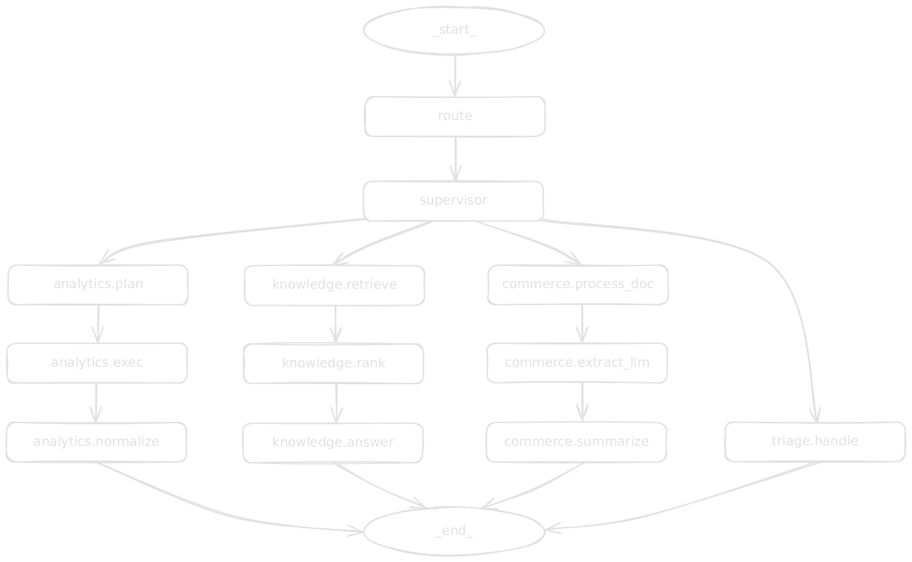

# Apllos Assistant Documentation

This documentation set provides an in-depth, implementation-level reference for the multi-agent assistant, covering architecture, graph orchestration, agents, routing, infrastructure, configuration, contracts, prompts/data/scripts, testing, operations, and design decisions.

## Overview

The Apllos Assistant is a multi-agent system built on LangGraph that provides assistance for e-commerce analytics, knowledge retrieval (RAG), and commerce document processing. The system uses prompt engineering with LLM-first approaches while maintaining fallbacks for reliability.

### Key Features

- **Multi-Agent Architecture**: Four specialized agents (Analytics, Knowledge, Commerce, Triage) with routing
- **LLM-First Design**: Prompt engineering with Chain-of-Thought reasoning, self-consistency checks, and confidence calibration
- **Performance Optimization**: Semantic caching for routing, embeddings, and responses; tool calling for efficient structured outputs
- **Cost Tracking**: Automatic LLM cost calculation and monitoring with Prometheus metrics
- **Conversation Context**: Natural follow-up conversations with semantic history search, topic shift detection, and anaphora resolution
- **Fallbacks**: Deterministic heuristics when LLMs are unavailable
- **Safety**: Multiple layers of protection including allowlists, read-only transactions, and human approval gates
- **Observability**: Logging, metrics, and tracing
- **Portuguese Language**: Native support for Brazilian Portuguese responses

### Multi-Agent Architecture Diagram

## Documentation Index

### Core Architecture

- **[Architecture and Graph Orchestration](core/architecture.md)** - System overview, graph structure, and orchestration patterns
- **[API Server and Endpoints](core/api.md)** - FastAPI server, health checks, and LangGraph integration
- **[Frontend (Chainlit)](core/frontend.md)** - Conversational UI, how to run locally and via ngrok
- **[Infrastructure](core/infra.md)** - LLM client, database, logging, metrics, tracing, and checkpointer
- **[Observability](core/observability.md)** - Monitoring, logging, metrics, and tracing
- **[Data Architecture](core/data_architecture.md)** - Data management, processing, and storage systems
- **[Routing System](core/routing.md)** - LLM classifier, supervisor, and ensemble routing
- **[Router vs Supervisor](core/router_vs_supervisor.md)** - Detailed comparison of routing components
- **[Security and Guardrails](core/security_guardrails.md)** - Security measures and safety mechanisms
- **[Design Decisions](core/design-decisions.md)** - Architectural Decision Records (ADRs) with rationale

### Agent Documentation

- **[Agents Overview](agents/agents_overview.md)** - Complete guide to all agents and their interactions
- **[Analytics Agent](agents/analytics.md)** - SQL planning, execution, and normalization for data queries
- **[Knowledge Agent (RAG)](agents/knowledge.md)** - Document retrieval, ranking, and answer generation
- **[Commerce Agent](agents/commerce.md)** - Document processing, extraction, and summarization
- **[Triage Agent](agents/triage.md)** - Fallback handling for ambiguous queries

### Development & Operations

- **[Configuration](development/configuration.md)** - Settings, models, and environment variables
- **[Contracts and Utilities](development/contracts_utils.md)** - Data contracts, validation, and utility functions
- **[Prompts, Data, and Scripts](development/prompts_data_scripts.md)** - Prompt engineering, data ingestion, and utility scripts
- **[Testing](development/testing.md)** - Unit tests, E2E tests, and safety guarantees
- **[Operations](operations/operations.md)** - Bootstrap, monitoring, and operational procedures
- **[Troubleshooting](operations/troubleshooting.md)** - Common issues, diagnostic procedures, and solutions

### Reference

- **[Examples and Use Cases](reference/examples.md)** - Practical applications and real-world examples
- **[FAQ](reference/faq.md)** - Frequently asked questions and answers
- **[Glossary](reference/glossary.md)** - Technical terms and concepts

## Key Concepts

### Router vs Supervisor

- **Router (LLM Classifier)**: Primary decision maker using LLM with tool calling (preferred) or JSON Schema structured output
  - Analyzes query intent, context, and signals
  - Uses prompt engineering with Chain-of-Thought reasoning
  - Tool calling reduces token usage compared to JSON Schema mode
  - Produces structured RouterDecision with confidence scores
  - Falls back to deterministic heuristics when LLM unavailable
  - Semantic caching for routing decisions to improve performance

- **Supervisor**: Deterministic guardrails and fallback logic
  - Applies business rules and safety constraints
  - Handles single-pass fallbacks to avoid routing loops
  - Recalibrates confidence scores conservatively
  - Enforces commerce document dominance when detected

### Agent Specializations

1. **Analytics Agent**: Converts natural language to safe SQL
   - Planner: NL → SQL with allowlist validation (uses tool calling for efficiency)
   - Executor: Read-only SQL execution with safety guards
   - Normalizer: Data balancing and PT-BR responses (with response caching)

2. **Knowledge Agent (RAG)**: Retrieves and synthesizes information
   - Retriever: Vector search with pgvector embeddings (with embedding caching)
   - Ranker: Heuristic + optional LLM reranking
   - Answerer: Cross-validated responses with citations (with response caching)

3. **Commerce Agent**: Processes commercial documents
   - Processor: Multi-format document extraction (PDF/DOCX/TXT/OCR)
   - Extractor: Structured data extraction with LLM
   - Summarizer: Executive summaries with risk analysis

4. **Triage Agent**: Handles ambiguous or insufficient context queries
   - Provides guidance and follow-up questions
   - Suggests appropriate agents based on signals

## How to Read This Documentation

### For New Team Members

1. Start with [Architecture](core/architecture.md) for system overview
2. Read [Design Decisions](core/design-decisions.md) for architectural rationale
3. Review [Glossary](reference/glossary.md) for terminology
4. Explore specific agent documentation as needed

### For Developers

1. [Architecture](core/architecture.md) - System design and patterns
2. [Configuration](development/configuration.md) - Settings and environment setup
3. [Operations](operations/operations.md) - Bootstrap and troubleshooting
4. Agent-specific docs for implementation details

### For Operations/SRE

1. [Operations](operations/operations.md) - Runbooks and procedures
2. [Infrastructure](core/infra.md) - Monitoring and observability
3. [Testing](development/testing.md) - Safety guarantees and validation
4. [API](core/api.md) - Health checks and endpoints

### For System Architects

1. [Design Decisions](core/design-decisions.md) - ADRs and rationale
2. [Architecture](core/architecture.md) - System design patterns
3. [Routing](core/routing.md) - Decision-making logic
4. [Configuration](development/configuration.md) - Extensibility and customization

## Conventions

- **Code references**: Use repository-relative paths (e.g., `app/agents/analytics/planner.py`)
- **Configuration**: References to `app/config/*.yaml` and [Settings](app/config/settings.py) models
- **Metrics**: Follow Prometheus naming conventions documented in [infra.md](core/infra.md)
- **Logging**: Use structured logging with context variables as shown in [observability.md](core/observability.md)
- **Testing**: Unit tests in `tests/unit/`, E2E tests in `tests/e2e/`, batch tests in `tests/batch/`